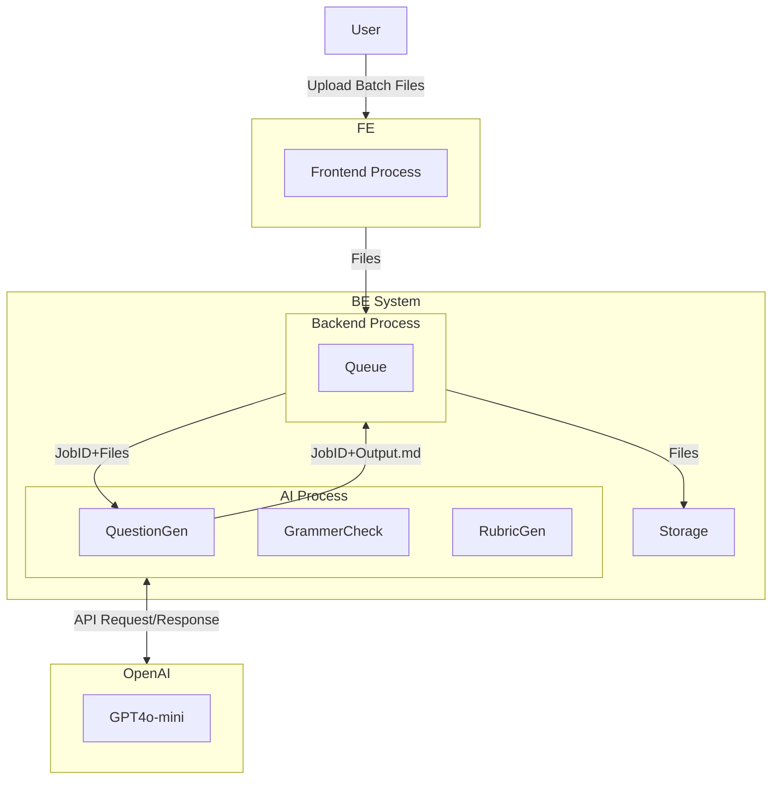

text text text to ancor us up here

```mermaid
    flowchart TD
    subgraph BE[BE System]
        subgraph BEproc[Backend Process]
            q[Queue]
        end
        Disk[Storage]
        subgraph AIproc[AI Process]
            Mod1[QuestionGen]
            Mod2[GrammerCheck]
            Mod3[RubricGen]
        end
    end

    user[User]

    subgraph FE
        FEproc[Frontend Process]
    end

    subgraph Open[OpenAI]
        GPT[GPT4o-mini]
    end

    %% Data flow of file upload & storage
    user --Upload Batch Files--> FE --Files--> BEproc --Files--> Disk
    BEproc --JobID+Files--> Mod1
    Mod1 --JobID+Output.md--> BEproc
    %% BEproc --> Disk


    AIproc <--API Request/Response--> Open
```
